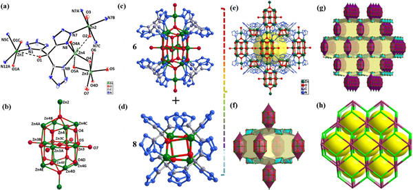
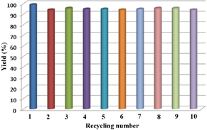

## [Zn116]纳米笼高效催化CO2与炔丙胺的成环反应

## Highly Efficient Conversion of Propargylic Amines and CO2 Catalyzed by Noble-Metal-Free [Zn116] Nanocages  
Authors: Chun-Shuai Cao+, Shu-Mei Xia+, Zhen-Jun Song+, Hang Xu+, Ying Shi, Liang-Nian He,*
Peng Cheng, and Bin Zhao*  

Angew. Chem. Int. Ed. **2020**, 59, 8586–8593  doi.org/10.1002/anie.201914596

​	何良年、赵斌等人报道了一种灯笼状的[Zn22(Trz)8(OH)12-(H2O)9·8H2O]n (Trz = (C4N12O)4-) 纳米笼。该纳米笼含有六个[Zn14O21]簇结构和八个[Zn4O4]簇结构，在常温常压下CO2的吸收量可达 27.00 cm3g-1。

​	在碱（1,5,7-triazabicyclo-[4.4.0]-dec-5-ene, TBD）的辅助下，这种纳米笼可以高效催化多种炔丙胺和CO2的环化反应。催化剂用量仅为0.27mol%，并且可以循环利用。

